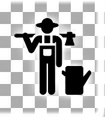

<!DOCTYPE HTML>
<head>
<meta charset="utf-8">

			<title> agriGOdig </title>
			<link rel="stylesheet" href="js/css/bootstrap.css">
			<link rel="stylesheet" href="js/css/bootstrap-theme.css">
			<link rel="stylesheet" href="css/mkulima.css">
			<link rel="icon" href="pics/logo.png">
</head>

<body>

						

							<nav class="list">
								<h3 class="admin"> HOME </h3>

								<ul class="list1">

									<li class="list2">
										<a href= "help/index.html" class="link"> ABOUT $ HELP </a>
									</li>

								</ul>
							</nav>

						

						<!-- Right column: content -->
						

              

			
<h1>  </h1>

	<nav id="navigationBar">
	<ul>
	<li><a class="btn link badge" href="login.php">FARMERS</a>
	<ul>
	<li><a class="link" href="login.php">LOGIN</a></li>
	<li><a class="link btn-toolbar" href="reg.php">REGISTER</a></li>
	</ul>
	<li><a class="link badge button" href="midmen/index.php">TRADERS</a>
	<ul>
	<li><a class="link btn-toolbar" href="midmen/index.php">LOGIN</a></li>
	<li><a class="link btn-toolbar" href="midmen/reg.php">REGISTER</a></li>
	</ul>
	</li>
	<li><a class="link badge" href="county_admin/index.php">COUNTY</a></li>
	<li><a class="link badge" href="national_admin/index.php">NATIONAL</a></li>
	</ul>
	</nav>

			
 <!-- container -->

</body>
</html>
